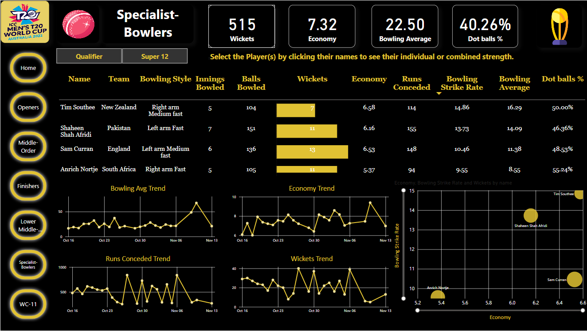

# **Project Title: T20 World Cup 2022 Cricket Analytics**

This project involved analyzing player and team performance data from the 2022 T20 World Cup using Python and Power BI.

## Documentation
Please refer to the [PDF report](./T20_Cricket_Project_Report.pdf) for more details on the methodology, data preprocessing, analysis, visualizations and insights.

## Dashboard Samples
Some samples of the interactive Power BI dashboards created for this analysis:
### Openers

### Middle-Order

### Finishers

### Lower Middle-Order

### Bowlers

### WC-11

## About the Analysis

- Data was web scraped from Cricbuzz using Python and processed into structured JSON records.

- JSON data was cleaned and transformed into CSV files for visualization in Power BI. 

- Interactive Power BI dashboards were created with insights on:

  - Top batsmen, bowlers and all-rounders

  - Team-wise analytics and contributions

  - Tournament XI based on player rankings

  - The dashboards include filters to analyze by team, player, match and stages.

## Future Work

Some ways this analysis can be enhanced further:

- Expanding to other tournaments using the same data pipeline.

- Incorporating sentiment analysis of match commentary.

- Building ML models to predict match outcomes.
